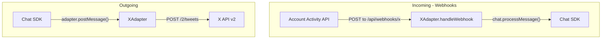

# X Adapter Implementation Plan

## Context: X API Pay-Per-Use Pricing (Jan 2026)

The X API uses **usage-based pricing** -- no subscriptions, credit-based:

- **Posts: Read** -- $0.005/resource
- **User: Read** -- $0.010/resource
- **Content: Create** -- $0.010/request
- **User Interaction: Create** -- $0.015/request (likes, follows)
- **DM Interaction** -- $0.015/request

The **Account Activity API** (webhooks) is available to all developers, so
the adapter follows the same webhook-based pattern as Slack, Teams, and
Google Chat.

---

## Ingestion Strategy: Webhooks

Like the other adapters, X uses standard webhook-based ingestion via the
Account Activity API. X POSTs events to `/api/webhooks/x` in real time.



- X sends a CRC challenge (GET) periodically to verify the webhook URL
- `handleWebhook()` verifies the `x-twitter-webhooks-signature` header, then
  processes `tweet_create_events`, `direct_message_events`, `favorite_events`
- Webhook payloads are v1.1 format -- the adapter translates to v2 concepts
  internally (e.g., resolving `conversation_id` via v2 API for threading)

```typescript
interface XAdapterOptions {
  apiKey: string; // Consumer Key (API Key)
  apiSecret: string; // Consumer Secret (for CRC + signature verification)
  accessToken: string; // User access token
  accessTokenSecret: string; // User access token secret
  botUsername?: string; // Auto-detected if not provided
}
```

---

## Threading Model

X's `conversation_id` maps directly to the SDK's thread concept. Every tweet in
a reply chain shares the same `conversation_id` (equal to the original tweet's
ID).

**Thread ID format:** `x:{conversation_id}` for tweet threads,
`x:dm:{dm_conversation_id}` for DMs.

```typescript
type XThreadId = {
  conversationId: string;
  type: "tweet" | "dm";
};
```

- Encoding: `encodeThreadId({ conversationId: "123", type: "tweet" })` -->
  `"x:123"`
- Encoding: `encodeThreadId({ conversationId: "abc", type: "dm" })` -->
  `"x:dm:abc"`
- Decoding: `decodeThreadId("x:123")` -->
  `{ conversationId: "123", type: "tweet" }`
- Decoding: `decodeThreadId("x:dm:abc")` -->
  `{ conversationId: "abc", type: "dm" }`

---

## SDK Choice: `@xdevplatform/xdk`

The official TypeScript SDK recommended at
[docs.x.com/xdks/typescript/overview](https://docs.x.com/xdks/typescript/overview):

```typescript
import { Client, OAuth1, type ClientConfig } from "@xdevplatform/xdk";

const oauth1 = new OAuth1({
  apiKey: options.apiKey,
  apiSecret: options.apiSecret,
  accessToken: options.accessToken,
  accessTokenSecret: options.accessTokenSecret,
});

const client = new Client({ oauth1 });
```

Key SDK capabilities used:

- `client.users.getMe()` -- resolve bot identity
- `client.users.getByUsername()` -- user lookups
- `client.tweets.createTweet()` -- post replies
- `client.tweets.deleteTweetById()` -- delete posts
- `client.tweets.findTweetById()` -- fetch single post with `conversation_id`
- `client.tweets.tweetsRecentSearch()` -- fetch thread via
  `conversation_id:{id}` query
- `client.users.usersIdLike()` / `usersIdUnlike()` -- like/unlike (reactions)

---

## Package Structure

```
packages/adapter-x/
+-- package.json
+-- tsconfig.json
+-- tsup.config.ts
+-- vitest.config.ts
+-- README.md
+-- sample-messages.md        # Example payloads for both modes
+-- src/
    +-- index.ts              # XAdapter class + createXAdapter factory
    +-- markdown.ts           # XFormatConverter
    +-- webhook.ts            # CRC challenge + signature verification
    +-- types.ts              # XThreadId, webhook payload types, config
    +-- index.test.ts         # Adapter tests
    +-- markdown.test.ts      # Format converter tests
    +-- webhook.test.ts       # Webhook verification tests
```

---

## Core Implementation Details

### 1. XAdapter Class ([packages/adapter-x/src/index.ts](packages/adapter-x/src/index.ts))

Implements `Adapter<XThreadId, unknown>`:

`**initialize(chat)`:

- Store chat instance
- Create `@xdevplatform/xdk` Client with OAuth1 auth
- Fetch bot identity via `client.users.getMe()` -- cache `botUserId` and
  `botUsername`

`**handleWebhook(request)`:

- **GET requests**: Extract `crc_token` query param, return CRC challenge
  response
- **POST requests**:
  - Verify `x-twitter-webhooks-signature` header using HMAC-SHA256 with consumer
    secret
  - Parse JSON body and route by event type:
    - `tweet_create_events` --> process mentions/replies
    - `direct_message_events` --> process DMs
    - `favorite_events` --> process reactions
  - Return 200 OK immediately, process asynchronously via `waitUntil`

`**postMessage(threadId, message)`:

- Decode thread ID
- For tweet threads:
  `client.tweets.createTweet({ text, reply: { in_reply_to_tweet_id: conversationId } })`
- For DMs: POST to `/2/dm_conversations/:dm_conversation_id/messages`
- Handle file attachments via media upload API (follow-up)

`**deleteMessage(threadId, messageId)`:

- `client.tweets.deleteTweetById(messageId)`

`**addReaction(threadId, messageId, emoji)`:

- Map any emoji to "like" (X's only reaction):
  `client.users.usersIdLike(botUserId, { tweet_id: messageId })`

`**removeReaction(threadId, messageId, emoji)`:

- `client.users.usersIdUnlike(botUserId, messageId)`

`**editMessage()`:

- Throw `NotImplementedError` -- X API does not support tweet editing

`**startTyping()`:

- No-op for tweet threads; DMs could potentially use typing indicator

`**fetchMessages(threadId, options?)`:

- `client.tweets.tweetsRecentSearch({ query: "conversation_id:{conversationId}", "tweet.fields": "conversation_id,author_id,created_at,in_reply_to_user_id", expansions: "author_id" })`
- Handle pagination with `next_token`
- Note: limited to last 7 days on recent search

`**fetchThread(threadId)`:

- Fetch root tweet:
  `client.tweets.findTweetById(conversationId, { "tweet.fields": "author_id,created_at,conversation_id", expansions: "author_id" })`
- Return `ThreadInfo` with author name as thread name

`**fetchMessage(threadId, messageId)`:

- `client.tweets.findTweetById(messageId, { ... })`

`**openDM(userId)`:

- POST to `/2/dm_conversations/with/:participant_id/messages` with initial
  message
- Return thread ID: `x:dm:{dm_conversation_id}`

`**isDM(threadId)`:

- `threadId.startsWith("x:dm:")`

### 2. Webhook Security ([packages/adapter-x/src/webhook.ts](packages/adapter-x/src/webhook.ts))

**CRC Challenge (X validates webhook URL periodically):**

```typescript
function handleCrcChallenge(
  crcToken: string,
  consumerSecret: string
): Response {
  const hmac = createHmac("sha256", consumerSecret)
    .update(crcToken)
    .digest("base64");
  return Response.json({ response_token: `sha256=${hmac}` });
}
```

**Signature Verification:**

```typescript
function verifyWebhookSignature(
  body: string,
  signature: string | null,
  consumerSecret: string
): boolean {
  if (!signature) return false;
  const expected =
    "sha256=" +
    createHmac("sha256", consumerSecret).update(body).digest("base64");
  return timingSafeEqual(Buffer.from(signature), Buffer.from(expected));
}
```

### 3. V1.1 Event Processing

The Account Activity API delivers v1.1 format payloads. Key differences from v2:

- `id_str` (string) instead of `id` (string in v2 too, but different field name)
- `user.screen_name` instead of `author_id` with expansion
- No `conversation_id` field -- must resolve via v2 API lookup or
  `in_reply_to_status_id_str`
- `extended_tweet.full_text` for longform posts (v2 always has full text)

**Conversation ID resolution for v1.1 payloads:**

```typescript
private async resolveConversationId(tweetIdStr: string, inReplyTo: string | null): Promise<string> {
  if (!inReplyTo) return tweetIdStr; // Root tweet

  const cacheKey = `x:conv:${tweetIdStr}`;
  const cached = await this.chat.state.get<string>(cacheKey);
  if (cached) return cached;

  // Fetch via v2 API to get conversation_id
  const v2Tweet = await this.client.tweets.findTweetById(tweetIdStr, {
    "tweet.fields": ["conversation_id"],
  });
  const conversationId = v2Tweet.data?.conversation_id ?? inReplyTo;
  await this.chat.state.set(cacheKey, conversationId, 86_400_000); // 24h cache
  return conversationId;
}
```

### 4. Format Converter ([packages/adapter-x/src/markdown.ts](packages/adapter-x/src/markdown.ts))

`XFormatConverter extends BaseFormatConverter`:

`**toAst(text, entities?)**` -- Parse X text to mdast:

- Replace `@username` mentions with text nodes
- Replace `https://t.co/...` URLs with link nodes using `expanded_url` from
  entities
- Preserve `#hashtags` as text
- Parse any remaining content as plain text paragraphs

`**fromAst(ast)**` -- Convert mdast to X-compatible plain text:

- Bold/italic/strikethrough --> stripped (tweets are plain text)
- Links `[text](url)` --> just the URL (X auto-links)
- Code/code blocks --> preserve with backticks
- Blockquotes --> `>` prefix
- Truncate at 280 characters with "..." if needed

`**renderPostable(message)**` -- Convert any `AdapterPostableMessage` to tweet
text:

- Handle `raw`, `markdown`, and `ast` types
- Apply `fromAst` conversion

---

## Shared Package Updates

### [packages/adapter-shared/src/card-utils.ts](packages/adapter-shared/src/card-utils.ts)

Add `"x"` to `PlatformName`:

```typescript
type PlatformName = "slack" | "gchat" | "teams" | "discord" | "x";
```

Add to `BUTTON_STYLE_MAPPINGS`:

```typescript
x: { primary: undefined, danger: undefined } // X has no rich card support
```

---

## Integration Wiring

### [examples/nextjs-chat/src/lib/adapters.ts](examples/nextjs-chat/src/lib/adapters.ts)

```typescript
if (process.env.X_API_KEY && process.env.X_API_SECRET) {
  adapters.x = createXAdapter({
    apiKey: process.env.X_API_KEY,
    apiSecret: process.env.X_API_SECRET,
    accessToken: process.env.X_ACCESS_TOKEN!,
    accessTokenSecret: process.env.X_ACCESS_TOKEN_SECRET!,
  });
}
```

### [turbo.json](turbo.json)

Add env vars: `X_API_KEY`, `X_API_SECRET`, `X_ACCESS_TOKEN`,
`X_ACCESS_TOKEN_SECRET`

The dynamic `[platform]` webhook route auto-handles `x` -- no route changes
needed.

---

## Test Plan

Following
[packages/adapter-slack/src/index.test.ts](packages/adapter-slack/src/index.test.ts)
patterns:

1. **Thread ID encoding/decoding** -- tweet threads (`x:123`) and DMs
   (`x:dm:abc`)
2. **CRC challenge** -- correct HMAC-SHA256 base64 response
3. **Webhook signature verification** -- valid, invalid, missing header cases
4. **Webhook event processing** -- v1.1 `tweet_create_events`,
   `direct_message_events`, `favorite_events`
5. **Conversation ID resolution** -- root tweets (self-ID), replies (v2 API
   lookup + cache)
6. **Message parsing** -- basic text, longform posts, entity extraction, media
7. **Self-message filtering** -- skip posts from `botUserId`
8. **Format converter** -- `toAst`/`fromAst` round-trips, entity handling,
   280-char truncation
9. **postMessage** -- tweet reply with `in_reply_to_tweet_id`, DM send
10. **fetchMessages** -- `conversation_id` search with pagination
11. **addReaction/removeReaction** -- like/unlike mapping

---

## Key Limitations and Future Work

- **No tweet editing** via API -- `editMessage()` throws `NotImplementedError`
- **No rich cards** -- cards rendered as fallback text only
- **Only "like" as reaction** -- all emoji reactions map to like/unlike
- **280-char limit** -- initial impl truncates; future: auto-split into tweet
  threads
- **7-day search window** -- `fetchMessages` via recent search only covers last
  7 days; full-archive requires additional access
- **Media upload** -- requires separate `POST /2/media/upload` before attaching;
  support in follow-up
- **V1.1 webhook payloads** -- Account Activity API delivers v1.1 format; the
  adapter resolves `conversation_id` via v2 API lookups (cached for 24h)
- **Cost awareness** -- each API call costs credits; the adapter should be
  efficient (cache user lookups, batch where possible)
- **Filtered Stream** -- could be added as an optional alternative ingestion
  mode in the future for developers who prefer persistent connections over
  webhooks
